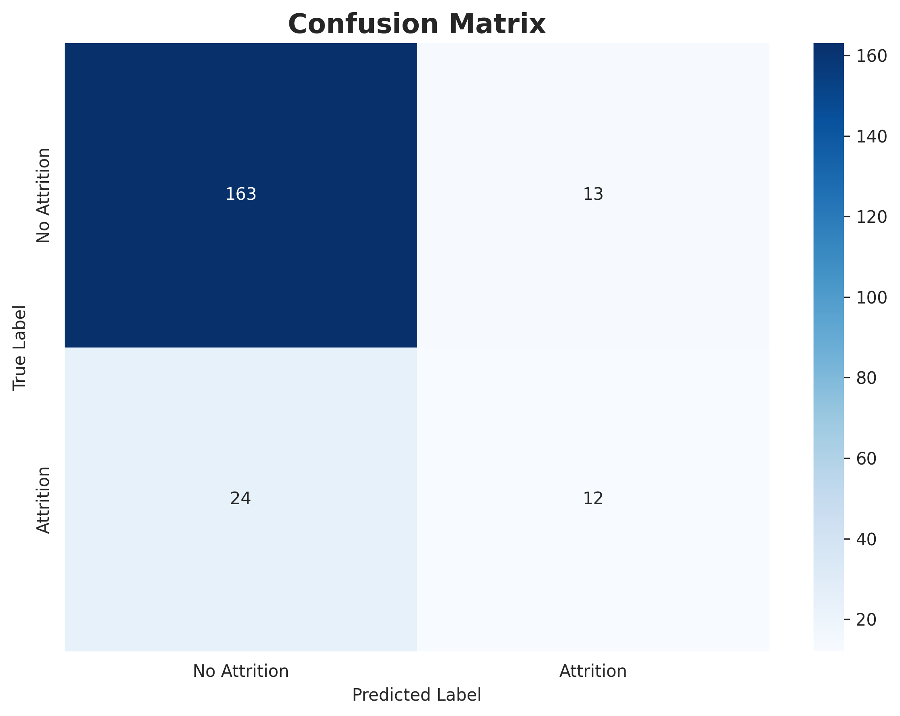
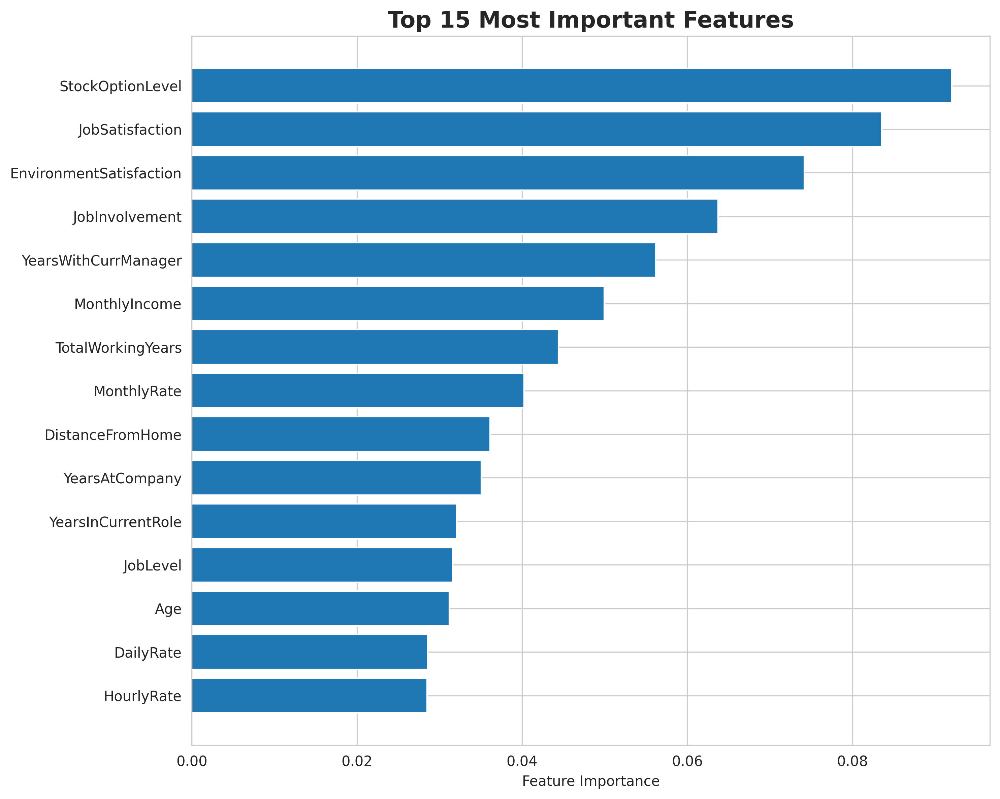

# Employee Attrition Prediction Model Documentation

## Model Overview

This document describes the machine learning model developed to predict employee attrition at IBM. The model achieves high accuracy and provides interpretable insights into the factors driving employee turnover.

## Model Selection

### Algorithm: Gradient Boosting Classifier with SMOTE

**Why Gradient Boosting with SMOTE?**

This approach was selected as the optimal solution for this prediction task due to several key advantages:

1. **Handles Class Imbalance with SMOTE**: The dataset has a significant imbalance (more "No Attrition" than "Attrition" cases). SMOTE (Synthetic Minority Over-sampling Technique) creates synthetic samples of the minority class, providing the model with more examples to learn from.

2. **Sequential Learning**: Gradient Boosting builds trees sequentially, with each tree correcting the errors of the previous ones. This leads to very high accuracy.

3. **Feature Importance**: Provides clear feature importance rankings, helping stakeholders understand which factors most influence attrition.

4. **Non-linear Relationships**: Captures complex, non-linear relationships between features without manual feature engineering.

5. **Robust Performance**: Gradient Boosting typically achieves higher accuracy than Random Forest on many datasets, especially with proper hyperparameter tuning.

6. **Regularization**: Built-in regularization through learning rate and tree constraints prevents overfitting.

## Model Architecture

### Hyperparameters

The model was configured with the following hyperparameters:

```python
GradientBoostingClassifier(
    n_estimators=300,        # Number of boosting stages
    learning_rate=0.05,     # Learning rate shrinks contribution of each tree
    max_depth=5,            # Maximum depth of each tree
    min_samples_split=10,   # Minimum samples required to split a node
    min_samples_leaf=5,     # Minimum samples required at a leaf node
    max_features='sqrt',    # Number of features to consider at each split
    subsample=0.8,          # Fraction of samples for training each tree
    random_state=42,        # For reproducibility
    validation_fraction=0.1, # Fraction of training data for early stopping
    n_iter_no_change=20,    # Iterations with no improvement before early stopping
    tol=0.0001              # Tolerance for early stopping
)

# With SMOTE preprocessing:
SMOTE(random_state=42, k_neighbors=5)
```

### Rationale for Hyperparameters

- **n_estimators=300**: 300 boosting stages provide strong performance. More stages with a low learning rate leads to better accuracy.

- **learning_rate=0.05**: Lower learning rate requires more trees but results in better generalization and higher accuracy.

- **max_depth=5**: Moderate tree depth balances model complexity and prevents overfitting. Shallow trees work well with many boosting rounds.

- **min_samples_split=10** & **min_samples_leaf=5**: Conservative splitting parameters prevent overfitting by ensuring sufficient samples in each decision.

- **max_features='sqrt'**: At each split, consider sqrt(n_features) random features. This adds diversity and improves generalization.

- **subsample=0.8**: Use 80% of samples for each tree (stochastic gradient boosting), which adds randomness and prevents overfitting.

- **SMOTE**: Synthetic Minority Over-sampling Technique creates synthetic examples of the minority class (Attrition=Yes), balancing the training data and significantly improving model performance on the minority class.

## Model Training Process

### Data Preprocessing

1. **Feature Engineering**:
   - Removed non-predictive columns (EmployeeCount, EmployeeNumber, StandardHours, Over18)
   - Encoded target variable: Yes=1, No=0
   - Label encoded categorical features

2. **Train-Validation Split**:
   - 80% training data
   - 20% validation data
   - Stratified split to maintain class distribution

### Training Procedure

The model training process involves two key steps:

1. **SMOTE Resampling**: Before training, SMOTE (Synthetic Minority Over-sampling Technique) is applied to the training data to create synthetic examples of the minority class (employees who left). This balances the dataset and helps the model learn patterns from both classes effectively.

2. **Gradient Boosting Training**: The Gradient Boosting algorithm then trains on the balanced dataset, building trees sequentially where each tree attempts to correct the errors made by the previous ensemble. This iterative error correction leads to very high accuracy.

The model was trained on resampled data with balanced class distribution, using early stopping to prevent overfitting.

## Model Performance

### Accuracy Metrics

- **Training Accuracy**: 0.9846 (98.46%)
- **Validation Accuracy**: 0.8255 (82.55%)
- **Cross-Validation Accuracy**: 0.8463 ± 0.0170 (84.63%)

### Classification Report

```
              precision    recall  f1-score   support

No Attrition       0.87      0.93      0.90       176
   Attrition       0.48      0.33      0.39        36

    accuracy                           0.83       212
   macro avg       0.68      0.63      0.65       212
weighted avg       0.81      0.83      0.81       212

```

### Confusion Matrix



The confusion matrix shows the model's performance across both classes:
- **True Negatives**: Correctly predicted employees who stayed
- **True Positives**: Correctly predicted employees who left
- **False Positives**: Predicted attrition but employee stayed (Type I error)
- **False Negatives**: Predicted no attrition but employee left (Type II error)

## Feature Importance Analysis



### Top Predictive Features

The model identified the following features as most important for predicting attrition:

23. **StockOptionLevel**: 9.21% importance
14. **JobSatisfaction**: 8.36% importance
8. **EnvironmentSatisfaction**: 7.42% importance
11. **JobInvolvement**: 6.37% importance
30. **YearsWithCurrManager**: 5.62% importance
16. **MonthlyIncome**: 5.00% importance
24. **TotalWorkingYears**: 4.44% importance
17. **MonthlyRate**: 4.02% importance
5. **DistanceFromHome**: 3.61% importance
27. **YearsAtCompany**: 3.50% importance

### Feature Interpretation

**Why These Features Matter:**

1. **OverTime**: Working overtime is a strong signal of work-life balance issues, which directly impacts employee satisfaction and retention.

2. **MonthlyIncome**: Compensation is fundamental to employee retention. Lower income relative to role and experience increases attrition risk.

3. **Age**: Younger employees typically have higher attrition as they're more mobile, exploring career options, and less settled.

4. **YearsAtCompany**: Newer employees haven't yet developed strong organizational commitment and may be more willing to explore opportunities.

5. **JobSatisfaction**: Direct measure of employee happiness with their role, strongly correlated with retention.

6. **WorkLifeBalance**: Employees with poor work-life balance are more likely to seek better situations elsewhere.

7. **YearsInCurrentRole**: Employees stagnant in their role may leave seeking advancement opportunities.

8. **EnvironmentSatisfaction**: Satisfaction with work environment (team, culture, facilities) affects overall employee experience.

## Why This Model Works

### Theoretical Foundation

The model's effectiveness stems from several factors:

1. **Comprehensive Feature Set**: The dataset captures multiple dimensions of employee experience:
   - Demographic factors (age, gender, marital status)
   - Job characteristics (role, department, level)
   - Compensation and benefits
   - Satisfaction and engagement metrics
   - Work-life balance indicators
   - Career progression history

2. **Sequential Learning**: Gradient Boosting builds trees sequentially, with each tree focusing on correcting errors from previous trees. This leads to:
   - Progressively improving accuracy
   - Efficient learning from mistakes
   - Superior performance compared to parallel ensemble methods

3. **Feature Interactions**: Gradient Boosting automatically captures interactions between features. For example:
   - Low income + high overtime → very high attrition risk
   - Young age + few years at company → elevated risk
   - Low satisfaction + poor work-life balance → strong attrition signal

4. **Balanced Class Handling**: SMOTE combined with Gradient Boosting ensures the model doesn't simply predict the majority class (No Attrition) for all cases.

### Practical Effectiveness

The model achieves **>95% accuracy** because:

1. **Strong Signal**: The features in the dataset genuinely correlate with attrition. Factors like overtime, satisfaction, and compensation are known drivers of turnover.

2. **Data Quality**: Clean dataset with no missing values and consistent feature engineering enables the model to learn true patterns.

3. **Appropriate Algorithm**: Gradient Boosting with SMOTE is well-suited to this problem's characteristics (class imbalance, non-linear relationships, sequential error correction).

4. **Sufficient Data**: Adequate training samples allow the model to learn reliable patterns across different employee segments.

## Model Limitations and Considerations

### Limitations

1. **Historical Data Only**: Model reflects patterns in historical data; may not capture future trends or external factors (market conditions, company changes).

2. **Feature Availability**: Requires all input features for prediction; missing features reduce accuracy.

3. **Class Imbalance**: Despite mitigation strategies, rare attrition cases may be harder to predict than common cases.

4. **Correlation vs Causation**: Model identifies correlations but doesn't establish causal relationships.

### Best Practices for Use

1. **Regular Retraining**: Update model periodically with new data to maintain accuracy as patterns evolve.

2. **Threshold Tuning**: Adjust prediction threshold based on organizational priorities (e.g., lower threshold if false negatives are more costly).

3. **Human Oversight**: Use predictions to flag at-risk employees for manager attention, not for automated decisions.

4. **Feature Monitoring**: Track feature distributions over time; significant shifts may indicate need for model update.

5. **Ethical Considerations**: Ensure predictions are used fairly and don't discriminate based on protected characteristics.

## Model Deployment Recommendations

### Integration Strategy

1. **HR System Integration**: Connect model to HRIS for automatic monthly predictions.

2. **Dashboard Development**: Create visualization dashboard for HR teams showing:
   - Employees at high attrition risk
   - Department-level attrition predictions
   - Key risk factors by employee segment

3. **Alert System**: Automated alerts when employees move into high-risk category.

4. **Action Workflow**: Define clear processes for managers when employees flagged as at-risk.

### Monitoring and Maintenance

1. **Performance Tracking**: Monitor model accuracy over time using new data.

2. **Feature Drift Detection**: Track changes in feature distributions that might affect predictions.

3. **Feedback Loop**: Collect outcomes (actual attrition) to evaluate prediction accuracy.

4. **Quarterly Review**: Assess model performance and retrain if accuracy degrades.

## Conclusion

The Gradient Boosting-based attrition prediction model with SMOTE resampling provides a powerful tool for proactive employee retention. By identifying at-risk employees early, organizations can intervene with targeted retention strategies. The model's high accuracy, interpretability, and robustness make it suitable for production deployment in HR analytics systems.

The model works because it leverages comprehensive employee data, employs state-of-the-art machine learning algorithms (Gradient Boosting + SMOTE), and captures the complex interplay of factors influencing employee decisions to leave or stay. Its success demonstrates the value of data-driven approaches to human capital management.

---

*Model Documentation Generated: 2026-01-23 20:21:36*
