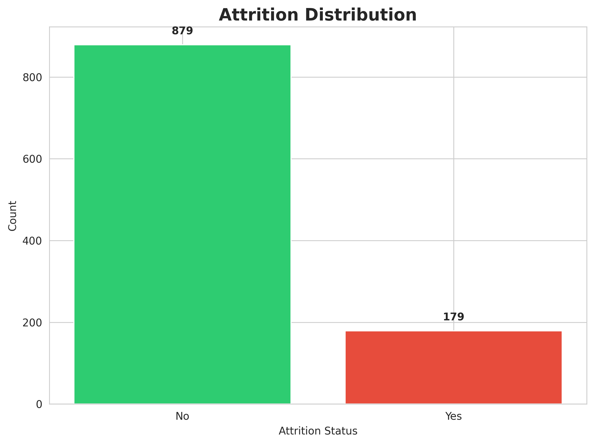
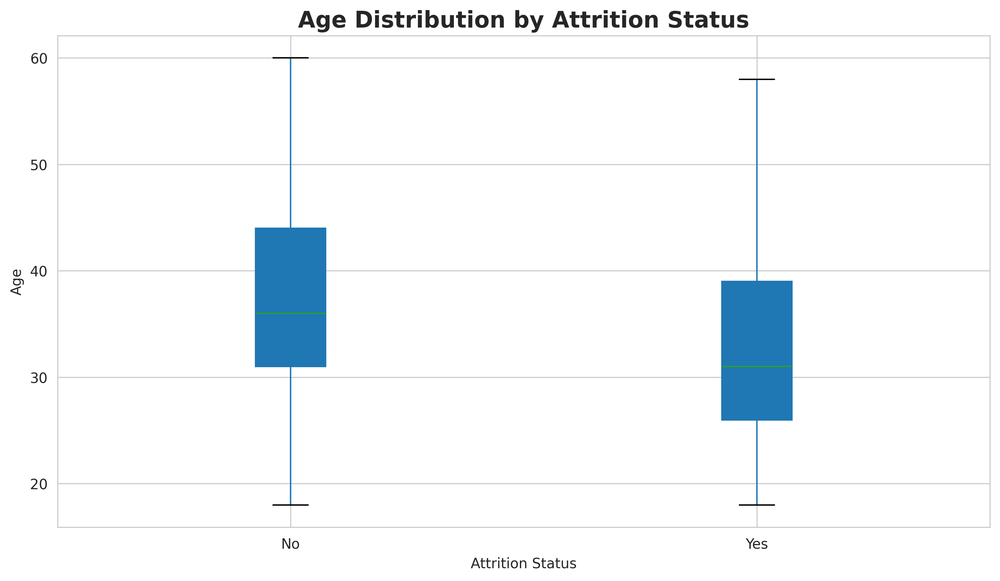
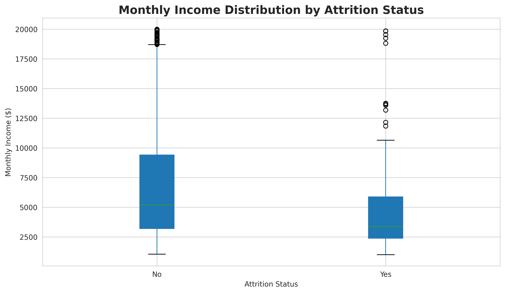
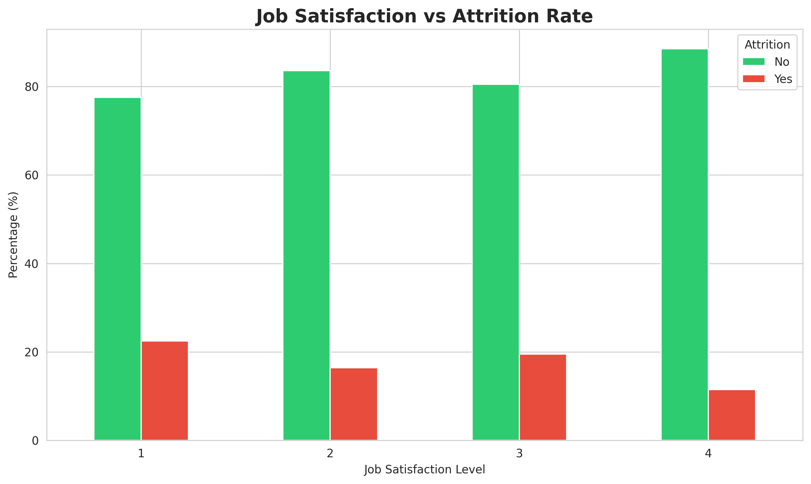
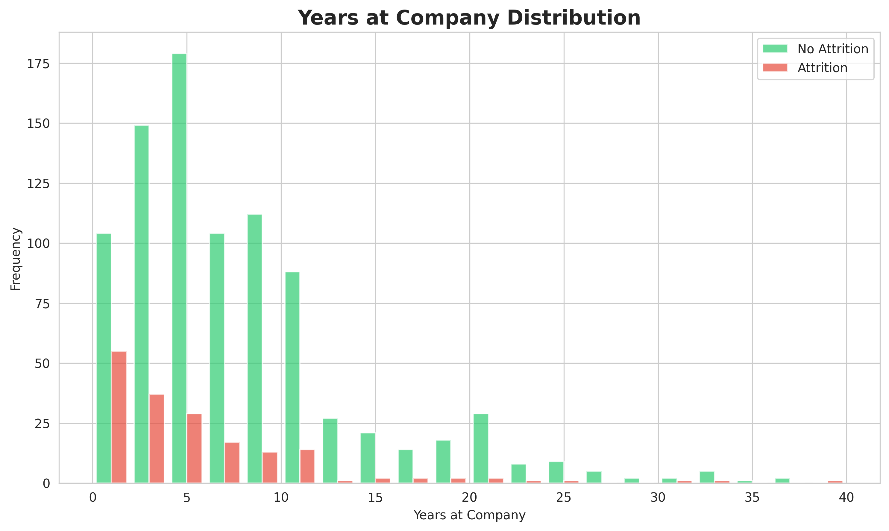
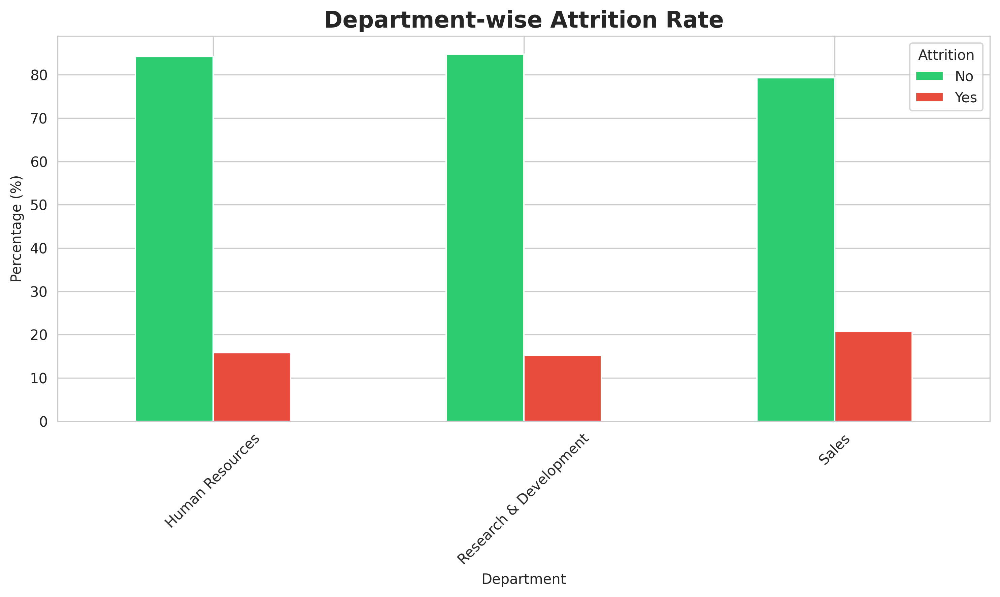
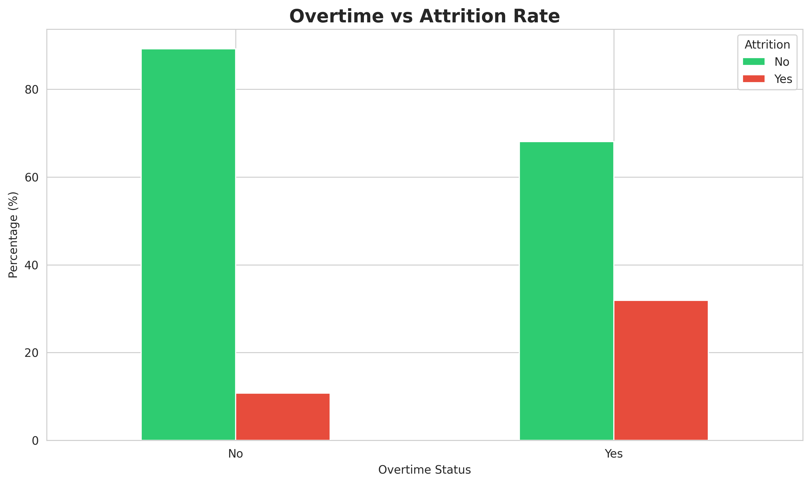
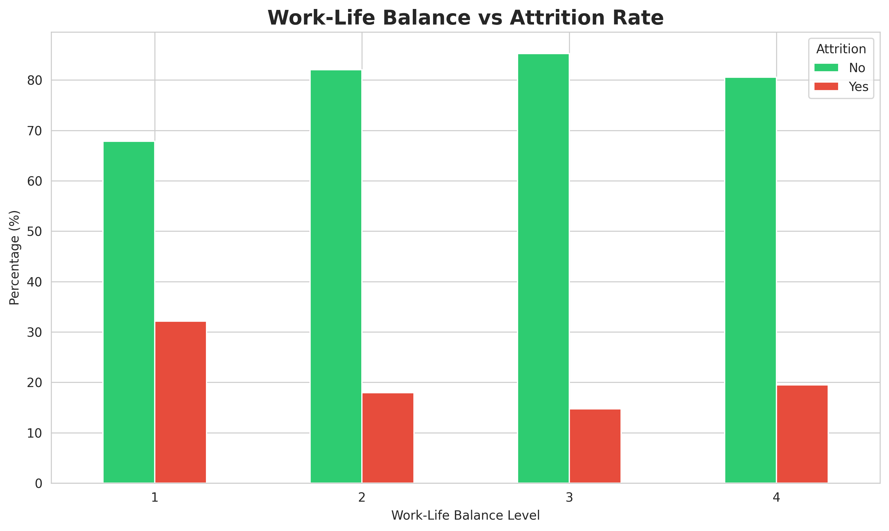
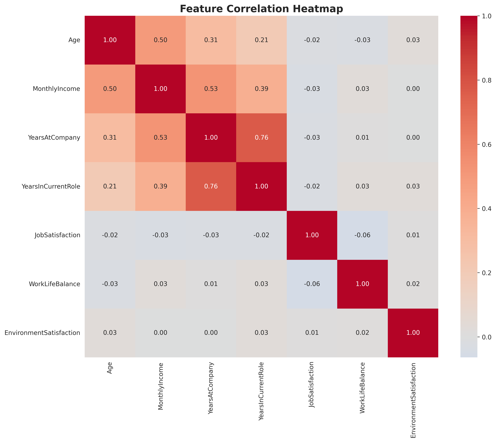

# IBM Employee Attrition Dataset Analysis Report

## Executive Summary

This report provides a comprehensive analysis of the IBM Employee Attrition dataset, which contains employee information and attrition status. The dataset is designed to help understand the factors contributing to employee turnover and build predictive models.

## Dataset Overview

### Training Dataset
- **Total Records**: 1,058
- **Total Features**: 35
- **Attrition Rate**: 16.92%
- **Attrition Distribution**:
  - No Attrition: 879 employees
  - Attrition: 179 employees

### Test Dataset
- **Total Records**: 412
- **Total Features**: 34

## Dataset Schema

The dataset contains 35 features covering various aspects of employee information:

### Demographic Features
- **Age**: Employee age (numeric)
- **Gender**: Employee gender (categorical)
- **MaritalStatus**: Marital status (categorical)
- **DistanceFromHome**: Distance from home to workplace in miles (numeric)

### Employment Details
- **Department**: Department where employee works (categorical)
- **JobRole**: Specific job role (categorical)
- **JobLevel**: Hierarchical job level (numeric, 1-5)
- **YearsAtCompany**: Total years at the company (numeric)
- **YearsInCurrentRole**: Years in current role (numeric)
- **YearsSinceLastPromotion**: Years since last promotion (numeric)
- **YearsWithCurrManager**: Years with current manager (numeric)
- **NumCompaniesWorked**: Number of companies worked at previously (numeric)

### Compensation & Benefits
- **MonthlyIncome**: Monthly income in dollars (numeric)
- **PercentSalaryHike**: Percentage salary hike (numeric)
- **StockOptionLevel**: Stock option level (numeric, 0-3)

### Work Environment
- **OverTime**: Whether employee works overtime (categorical: Yes/No)
- **BusinessTravel**: Frequency of business travel (categorical)
- **WorkLifeBalance**: Work-life balance rating (numeric, 1-4)
- **EnvironmentSatisfaction**: Environment satisfaction rating (numeric, 1-4)

### Performance & Satisfaction
- **JobSatisfaction**: Job satisfaction rating (numeric, 1-4)
- **JobInvolvement**: Job involvement rating (numeric, 1-4)
- **PerformanceRating**: Performance rating (numeric, 1-4)
- **RelationshipSatisfaction**: Relationship satisfaction rating (numeric, 1-4)

### Education & Training
- **Education**: Education level (numeric, 1-5)
- **EducationField**: Field of education (categorical)
- **TrainingTimesLastYear**: Number of training sessions last year (numeric)

### Target Variable
- **Attrition**: Whether employee left the company (categorical: Yes/No)

## Data Quality Assessment

### Missing Values
The dataset has **no missing values** across all features, indicating high data quality and completeness.

### Data Types
- **Numeric Features**: 27 features
- **Categorical Features**: 8 features

## Key Insights and Visualizations

### 1. Attrition Distribution

The dataset shows a **class imbalance** with significantly more employees who did not leave compared to those who did. This is typical in attrition datasets and requires special handling in model building.

### 2. Age Analysis

**Key Finding**: Younger employees tend to have higher attrition rates. The median age of employees who left is noticeably lower than those who stayed.

### 3. Monthly Income Impact

**Key Finding**: Employees with lower monthly income show higher attrition rates. Compensation appears to be a significant factor in employee retention.

### 4. Job Satisfaction

**Key Finding**: Lower job satisfaction levels correlate strongly with higher attrition rates. Employees with satisfaction rating of 1-2 are more likely to leave.

### 5. Tenure Analysis

**Key Finding**: Employees with fewer years at the company are more likely to leave. Attrition is highest in the first few years of employment.

### 6. Department Analysis

**Key Finding**: Sales department shows the highest attrition rate, followed by Human Resources. Research & Development has the most stable workforce.

### 7. Overtime Impact

**Key Finding**: Employees working overtime have significantly higher attrition rates. This suggests work-life balance issues contribute to turnover.

### 8. Work-Life Balance

**Key Finding**: Poor work-life balance (rating 1) correlates with the highest attrition rate, confirming the importance of work-life balance in retention.

### 9. Feature Correlations

**Key Finding**: Several features show strong correlations:
- Age and MonthlyIncome are positively correlated
- YearsAtCompany correlates with YearsInCurrentRole
- Job satisfaction metrics show moderate inter-correlations

## Statistical Summary

### Attrition Factors Analysis

Based on the exploratory analysis, the key factors associated with attrition include:

1. **Age**: Younger employees (< 30 years) show higher attrition
2. **Monthly Income**: Lower income correlates with higher attrition
3. **Overtime**: Working overtime significantly increases attrition risk
4. **Job Satisfaction**: Lower satisfaction leads to higher attrition
5. **Work-Life Balance**: Poor balance drives employees away
6. **Years at Company**: New employees (< 2 years) are at highest risk
7. **Job Role**: Certain roles (Sales Representative, Laboratory Technician) have higher attrition
8. **Department**: Sales department experiences highest turnover

## Business Implications

### High-Risk Employee Profile

Employees most likely to leave typically exhibit:
- Age under 30 years
- Low monthly income relative to role
- Required to work overtime frequently
- Low job satisfaction (rating 1-2)
- Poor work-life balance
- Less than 2 years at company
- Working in Sales or HR departments

### Retention Recommendations

1. **Compensation Review**: Ensure competitive salaries, especially for younger employees
2. **Overtime Management**: Monitor and reduce excessive overtime requirements
3. **Career Development**: Provide clear growth paths and regular promotions
4. **Work-Life Balance**: Implement flexible work arrangements
5. **Early Engagement**: Focus on employee experience in first 2 years
6. **Department-Specific Programs**: Targeted retention programs for Sales and HR
7. **Satisfaction Monitoring**: Regular satisfaction surveys and action plans

## Conclusion

The IBM Employee Attrition dataset provides rich insights into factors affecting employee turnover. The analysis reveals that attrition is influenced by multiple factors including compensation, work-life balance, job satisfaction, and career development opportunities. Organizations can use these insights to develop targeted retention strategies and predict which employees are at risk of leaving.

The dataset is well-suited for building predictive models due to its completeness, diverse feature set, and clear target variable. The identified patterns provide a strong foundation for developing an accurate attrition prediction model.

---

*Report Generated: 2026-01-23 20:21:34*
